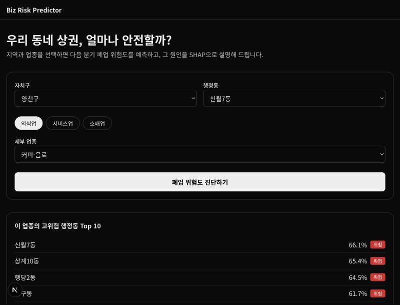
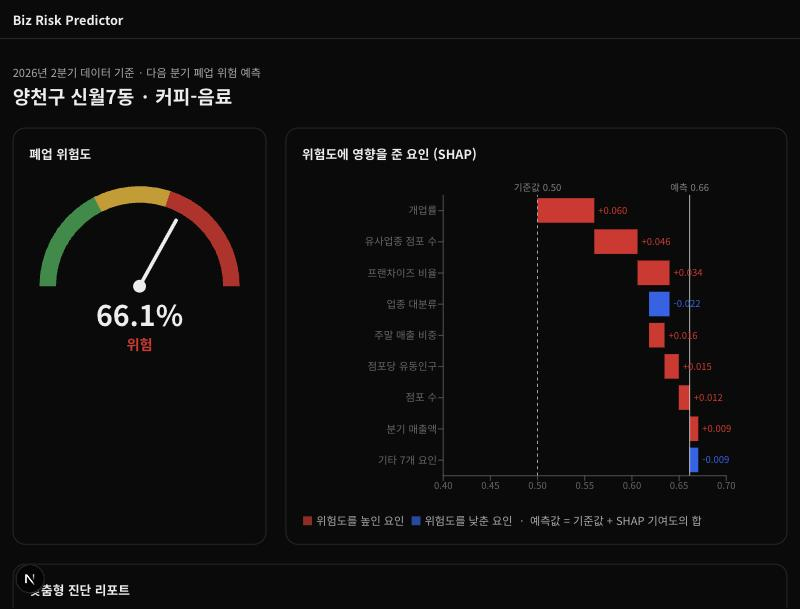
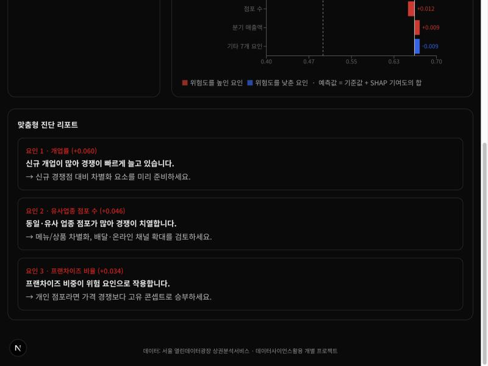
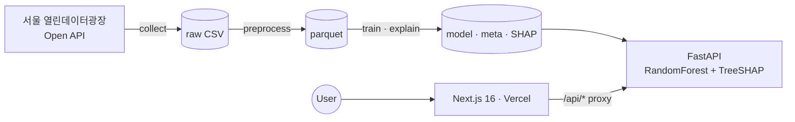

# Biz Risk Predictor

**서울시 상권 폐업 위험도 예측 및 SHAP 원인 진단 웹 서비스**

> "이 동네에서 이 업종, 다음 분기에 위험할까? 그리고 **왜?**"
> 서울시 상권분석서비스 공공데이터로 행정동 × 업종별 **다음 분기 폐업 위험도**를 예측하고, 그 이유를 **SHAP(설명 가능한 AI)** 으로 보여줍니다.


> 📌 **진행 상태 (2026-10 · 중간 발표 단계)**: 기획 확정 → **실데이터 확보(약 116만 행)** → 1차 모델 학습 → 웹 프로토타입 연동까지 완료했습니다.
> 서울 425개 행정동 × 100개 업종, 2021Q1~2026Q2. 1차 Random Forest **Test AUC 0.734** (단순 베이스라인 0.558). 개선은 8~10주차에 진행합니다.

| 대시보드 | 진단 결과 | 맞춤형 리포트 |
| --- | --- | --- |
|  |  |  |

---

## ✨ 주요 기능

- **위험도 예측**: 자치구 → 행정동, 업종을 선택하면 다음 분기 폐업 위험 확률과 등급(안정/보통/위험)을 보여줍니다.
- **원인 설명**: SHAP 폭포형 그래프로 위험을 **높인 요인(빨강)** 과 **낮춘 요인(파랑)** 을 수치와 함께 표시합니다. `예측값 = 기준값 + ΣSHAP`
- **맞춤형 진단**: 위험을 높인 상위 3개 요인을 진단 문장과 대응 가이드로 바꿔 줍니다.
- **고위험 동 랭킹**: 선택한 업종에서 위험도가 높은 행정동 Top 10을 보여줍니다.

## 🧠 핵심 설계 포인트

| | 내용 |
| --- | --- |
| **데이터 누수 차단** | 같은 분기 폐업률로 레이블과 피처를 함께 만들지 않고, **t분기 피처로 t+1분기 위험을 예측** |
| **시간 기준 분할** | 무작위 분할 대신 마지막 4개 분기를 테스트셋으로 사용해 실제 사용 상황과 일치 |
| **업종별 레이블 기준** | 외식/서비스/소매 대분류별 70분위수를 학습 구간에서만 계산해 업종 편향과 누출 방지 |
| **EDA 기반 보정** | 37개 업종은 추정매출이 아예 없음을 발견 → 중앙값으로 채우기 전에 `has_sales` 피처 추가 |
| **설명 가능성 검증** | TreeSHAP 가법성(`base + ΣSHAP == predict_proba`)을 코드에서 `assert`로 확인 |
| **목업 모드** | ML 서버가 없어도 Next.js가 목업 응답으로 동작해 프론트엔드를 따로 개발할 수 있음 |

## 🏗 아키텍처



| 영역 | 기술 |
| --- | --- |
| Data / ML | pandas, NumPy, scikit-learn (DecisionTree, RandomForest, GridSearchCV), SHAP, matplotlib |
| API | FastAPI, Uvicorn |
| Web | Next.js 16 (App Router), React 19, TypeScript, Tailwind CSS 4, Recharts 3 |
| Deploy (예정) | Vercel · Heroku/Azure (GitHub Student Pack) · Namecheap `.me` — **운영비 $0** |

## 📊 데이터

| 데이터셋 | ID | 단위 |
| --- | --- | --- |
| 서울시 상권분석서비스(점포-행정동) | [OA-22172](https://data.seoul.go.kr/dataList/OA-22172/S/1/datasetView.do) | 분기 × 행정동 × 업종 |
| 서울시 상권분석서비스(추정매출-행정동) | [OA-22175](https://data.seoul.go.kr/dataList/OA-22175/S/1/datasetView.do) | 분기 × 행정동 × 업종 |
| 서울시 상권분석서비스(길단위인구-행정동) | [OA-22178](https://data.seoul.go.kr/dataList/OA-22178/S/1/datasetView.do) | 분기 × 행정동 |

## 🚀 실행 방법

```bash
# 0) Python 환경 (iCloud 동기화 폴더라면 .nosync로 만들어 동기화에서 제외 — 아래 '주의' 참고)
python3 -m venv .venv.nosync && ln -s .venv.nosync .venv && source .venv/bin/activate
pip install -r ml/requirements.txt -r api/requirements.txt
python -m ipykernel install --user --name biz-risk-predictor   # 노트북 커널 등록

# 1) 데이터 → 모델
cd ml
cp .env.example .env              # SEOUL_API_KEY 입력 (키 없이 시험하려면 python -m pipeline.make_mock)
python -m pipeline.collect
python -m pipeline.preprocess
python -m pipeline.train
python -m pipeline.explain
cd ..

# 2) API 서버  → http://localhost:8000/docs
cd api && uvicorn app.main:app --reload --port 8000

# 3) 웹 (새 터미널)  → http://localhost:3000
cd web && npm install
echo "ML_API_URL=http://localhost:8000" > .env.local   # 비워두면 목업 모드
npm run dev
```

> ⚠️ **iCloud(데스크탑 및 문서 폴더 동기화) 안에서 개발할 때**
> "Mac 저장 공간 최적화"가 켜져 있으면 `.venv`, `node_modules`의 파일이 클라우드로 내려가고 로컬에서 비워집니다(dataless). 그러면 import나 빌드가 멈춥니다.
> - Python 가상환경: `.venv.nosync` 폴더(이름이 `.nosync`로 끝나면 iCloud가 동기화하지 않음)에 만들고 `.venv` 심볼릭 링크를 둡니다.
> - `node_modules`는 심볼릭 링크로 바꾸면 Turbopack이 모듈을 찾지 못합니다. 대신 동기화 제외 속성을 붙입니다.
>   `xattr -w 'com.apple.fileprovider.ignore#P' 1 web/node_modules` (`web/.next`, `data/raw`, `data/processed`, `ml/artifacts`, `.git`에도 적용)

## 📁 문서

| 문서 | 내용 |
| --- | --- |
| [01 기획서 v2](docs/01_proposal.md) | 문제 정의, 강의 연계, 데이터, 일정, v1 대비 변경 이력 |
| [02 데이터셋 확보 가이드](docs/02_dataset_guide.md) | 인증키 발급 단계별 안내, 컬럼 명세, 수집·임시 데이터 |
| [03 GitHub Student Pack 가이드](docs/03_github_student_pack.md) | 신청 방법, 배포 옵션 비교, 도메인 연결 |
| [04 아키텍처 & API 명세](docs/04_architecture.md) | 구조도, 디렉터리, 엔드포인트, 환경변수 |
| [05 모델링 리포트](docs/05_modeling.md) | 레이블 설계, 튜닝, 평가, SHAP 해석 |
| [06 중간 발표 자료](docs/06_presentation.md) | 슬라이드 구성안, 발표 대본, 예상 질문 |
| [07 개발 일지](docs/07_devlog.md) | 날짜별 작업, 의사결정 기록, 트러블슈팅 |

## 🗺 로드맵

- [x] 기획 확정 및 데이터 확보 경로 검증
- [x] 수집·전처리·학습·SHAP 파이프라인 (임시 데이터로 먼저 검증 후 실데이터 적용)
- [x] FastAPI + Next.js 프로토타입
- [x] 인증키 발급 및 실데이터 수집 (점포 77.5만 · 매출 37.6만 · 유동인구 9,350행)
- [x] 실데이터 1차 모델 (RF Test AUC 0.734) 및 SHAP 해석
- [ ] 레이블 재설계(점포 수 편향 완화), 확률 보정, Recall 중심 threshold (8~10주차)
- [ ] 배포: Vercel + Heroku + 커스텀 도메인 (14주차)
- [ ] 확장: 행정동 지도 시각화, 상권변화지표·상주/직장인구 피처

---

<sub>건국대학교 「데이터사이언스활용」 개별 프로젝트 · 데이터 출처: 서울 열린데이터광장 · 서울신용보증재단 상권분석서비스</sub>
