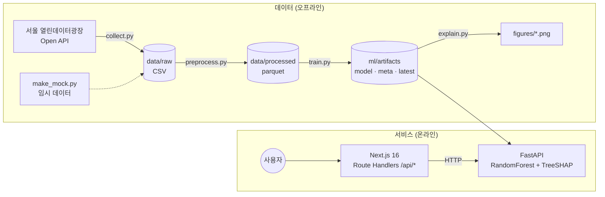

# 시스템 아키텍처 & API 명세

## 1. 전체 구조



- **오프라인**: 분기마다 데이터를 수집하고 모델을 다시 학습합니다. 결과물(`artifacts`)만 API 서버로 옮기면 됩니다.
- **온라인**: API 서버는 시작할 때 최신 분기의 전체 (행정동 × 업종) 조합 확률을 미리 계산해 둡니다. SHAP 분해는 요청이 들어올 때 1건씩 계산합니다(TreeSHAP이라 수십 ms 수준).
- **프록시 구조**: 브라우저는 Next.js의 `/api/*`만 호출합니다. ML 서버 주소는 서버 환경변수(`ML_API_URL`)에만 있고 브라우저에는 노출되지 않습니다.
- **목업 모드**: `ML_API_URL`이 비어 있으면 Next.js가 `src/lib/mock.ts`의 가짜 응답을 돌려줍니다. 그래서 ML 서버 없이도 프론트엔드를 개발할 수 있습니다.

## 2. 디렉터리 구조

```
biz-risk-predictor/
├── data/{raw,processed}/        # 원천·가공 데이터 (git 제외)
├── ml/
│   ├── pipeline/
│   │   ├── config.py            # 경로, 피처 정의(한글 라벨), 레이블·분할·위험구간 설정
│   │   ├── collect.py           # Open API 페이지네이션 수집 (1,000건 단위)
│   │   ├── make_mock.py         # API와 같은 스키마의 임시 데이터 생성
│   │   ├── preprocess.py        # 병합, 결측치, 파생 피처, t+1 레이블 원천
│   │   ├── train.py             # 시간 분할, GridSearchCV, 평가, 아티팩트 저장
│   │   └── explain.py           # SHAP 가법성 검증, 시각화
│   ├── notebooks/01_eda_modeling.ipynb
│   └── artifacts/               # 학습 산출물 (git 제외)
├── api/
│   ├── app/main.py              # FastAPI 엔드포인트
│   ├── app/model.py             # 모델 로드, 예측, SHAP 분해
│   ├── app/advice.py            # SHAP 상위 요인 → 진단 문장 (규칙 기반)
│   └── Procfile                 # Heroku 실행 명령
├── web/src/
│   ├── app/page.tsx             # 대시보드
│   ├── app/diagnosis/page.tsx   # 진단 결과
│   ├── app/api/*/route.ts       # ML API 프록시 (options, map, diagnose)
│   ├── components/              # RiskGauge, ShapWaterfall, AdviceReport, RiskRanking, Dashboard
│   └── lib/                     # 타입, 목업 데이터, ML API 클라이언트
└── docs/                        # 기획서, 가이드, 발표 자료, 개발 일지
```

## 3. 기술 스택

| 영역 | 사용 기술 | 버전 |
| --- | --- | --- |
| 데이터/ML | Python, pandas, NumPy, scikit-learn, SHAP, matplotlib, PyArrow | Python 3.12 |
| API | FastAPI, Uvicorn | |
| Web | Next.js (App Router, Turbopack), React, TypeScript, Tailwind CSS, Recharts | Next 16.4 / React 19.3 / Tailwind 4 / Recharts 3 |
| 배포 | Vercel (web), Heroku 또는 Azure (api), Namecheap (domain) | |

## 4. API 명세 (FastAPI, `http://localhost:8000/docs`에서 Swagger 확인)

### `GET /options`
선택 가능한 자치구·행정동·업종 목록과 기준 분기를 반환합니다.

```json
{
  "quarter": "20262",
  "gu": [{ "code": "11470", "name": "양천구", "dongs": [{ "code": "11470510", "name": "목1동" }] }],
  "industries": [{ "code": "CS100010", "name": "커피-음료", "group": "CS1" }]
}
```

### `GET /map?industry_code=CS100010`
해당 업종의 모든 행정동 위험도를 반환합니다. (Top 10 목록과 향후 지도 표시에 사용)

```json
[{ "dong_code": "11470611", "dong_name": "신월7동", "probability": 0.6612, "level": "위험" }]
```

### `GET /diagnose?dong_code=11470611&industry_code=CS100010`

```json
{
  "quarter": "20262",
  "gu_name": "양천구", "dong_name": "신월7동", "industry_name": "커피-음료",
  "probability": 0.6612, "level": "위험", "base_value": 0.4999,
  "contributions": [
    { "feature": "open_rate", "label": "개업률", "value": 7.0, "shap": 0.0602 },
    { "feature": "similar_store_count", "label": "유사업종 점포 수", "value": 14.0, "shap": 0.0459 }
  ],
  "advice": [
    { "feature": "open_rate", "label": "개업률", "shap": 0.0602,
      "finding": "신규 개업이 많아 경쟁이 빠르게 늘고 있습니다.",
      "action": "신규 경쟁점 대비 차별화 요소를 미리 준비하세요." }
  ]
}
```

- `base_value + Σ contributions[].shap == probability` (TreeSHAP 가법성)
- 업종 원-핫 피처 3개의 SHAP 값은 하나로 합쳐서 `"업종 대분류"`로 보여줍니다.
- 데이터가 없거나 점포 수가 5개 미만인 조합은 `404`를 반환합니다.

### Next.js 프록시 경로

| 브라우저 호출 | → ML API |
| --- | --- |
| `GET /api/options` | `GET /options` |
| `GET /api/map?industry=` | `GET /map?industry_code=` |
| `GET /api/diagnose?dong=&industry=` | `GET /diagnose?dong_code=&industry_code=` |

## 5. 환경변수

| 위치 | 변수 | 설명 |
| --- | --- | --- |
| `ml/.env` | `SEOUL_API_KEY` | 서울 열린데이터광장 일반 인증키 |
| `api` | `ARTIFACT_DIR` | 모델 아티팩트 경로 (기본값 `../ml/artifacts`) |
| `api` | `ALLOWED_ORIGINS` | CORS 허용 도메인, 쉼표로 구분 (기본값 `http://localhost:3000`) |
| `web/.env.local` | `ML_API_URL` | FastAPI 주소. 비워두면 목업 모드 |
