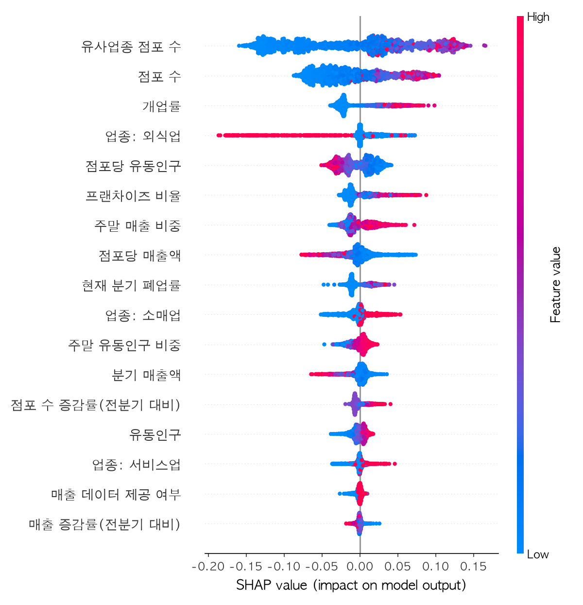
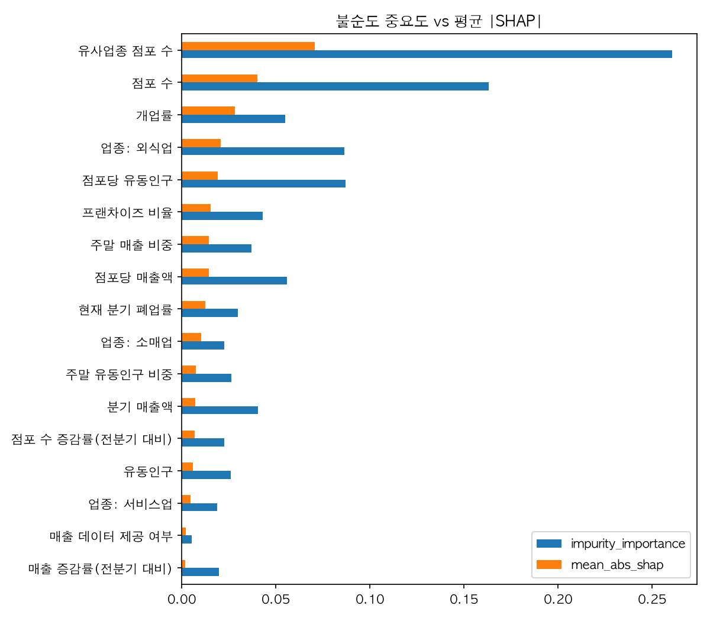
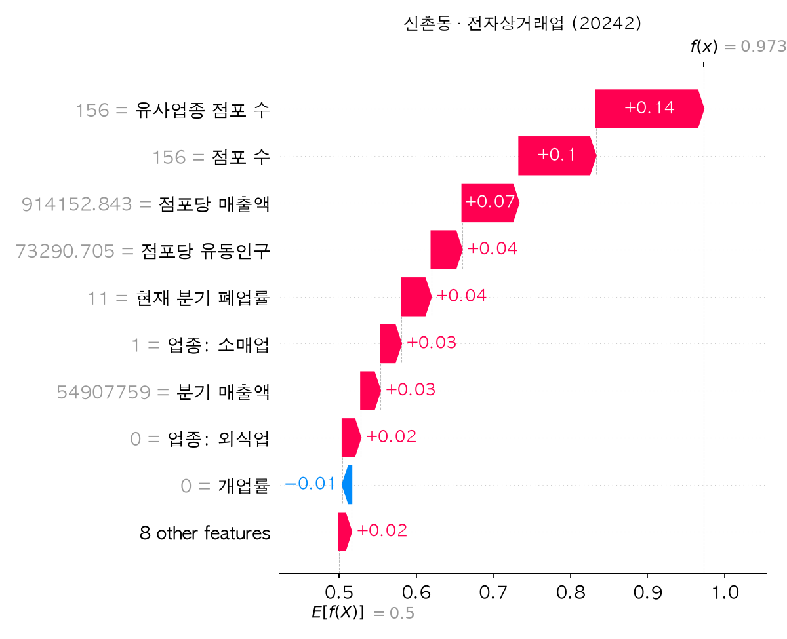

# 모델링 리포트 (실데이터 1차 결과)

> 서울 열린데이터광장 Open API에서 2026-10-08 수집한 **실데이터** 기준입니다.
> 하이퍼파라미터와 레이블 설계를 아직 다듬기 전의 **1차 베이스라인** 결과이고, 8~10주차에 개선합니다.

---

## 1. 데이터 개요

| 항목 | 값 |
| --- | --- |
| 기간 | 2021Q1 ~ 2026Q2 (22개 분기) |
| 지역 | 서울 25개 자치구, **425개 행정동** |
| 업종 | **100개** 서비스업종 (외식 CS1 10개 / 서비스 CS2 / 소매 CS3) |
| 원천 행 수 | 점포 775,084 · 추정매출 376,485 · 길단위인구 9,350 |
| 키 중복 | 없음 (분기 × 행정동 × 업종 기준) |

### 1.1 EDA에서 발견한 점
| 발견 | 수치 | 대응 |
| --- | --- | --- |
| 점포 수가 적은 조합이 많음 | 중앙값 6개, 점포 5개 이상인 행 59.6% | 점포 5개 미만 제외 (노이즈 제거) |
| 폐업률 0인 행이 대부분 | 점포 5개 이상 중 **65.8%가 폐업률 0** | 레이블 임곗값 설계에 반영 (§2) |
| **추정매출 미제공 업종** | 100개 업종 중 **37개는 매출 데이터가 전혀 없음** (변호사·세무사 사무소, 독서실, 주유소 등) | 결측을 중앙값으로 채우기 전에 `has_sales`(매출 제공 여부) 피처를 추가 |
| 업종별 매출 제공률 차이 | 외식 96.4%, 서비스 62.4%, 소매 67.7% | 위와 같음 |

---

## 2. 문제 정의와 레이블

- **질문**: "이 행정동에서 이 업종은 **다음 분기**에 폐업이 많이 일어날까?"
- **레이블**: `다음 분기 폐업률 > 학습 구간에서 업종 대분류별로 구한 70분위수` → 1(고위험)

| 업종 대분류 | 임곗값 (학습 구간 기준) | 의미 |
| --- | --- | --- |
| CS1 외식업 | 6.0% | 다음 분기 폐업률이 6%를 넘으면 고위험 |
| CS2 서비스업 | 1.0% | 사실상 "다음 분기에 폐업이 1건 이상 발생" |
| CS3 소매업 | 1.0% | 위와 같음 |

### 2.1 데이터 누수 방지 (v1 → v2)
v1 기획의 예시 코드는 같은 분기 폐업률로 레이블을 만들면서 그 값을 피처로도 넣었습니다. 이렇게 하면 모델이 정답을 보고 맞히게 됩니다. v2에서는 **t분기 피처로 t+1분기를 예측**합니다. 현재 분기 폐업률은 과거 정보이므로 피처로 써도 정당합니다.

---

## 3. 데이터셋 구성

| 구분 | 분기 | X shape | 양성 비율 |
| --- | --- | --- | --- |
| Train | 2021Q1 ~ 2025Q1 | (357,327, 17) | 28.0% |
| Test (시간 기준 홀드아웃) | 2025Q2 ~ 2026Q1 | (83,727, 17) | 26.3% |
| 추론용 latest | 2026Q2 (레이블 없음) | (20,862, 17) | – |

피처 17개: 점포 수, 유사업종 점포 수, 프랜차이즈 비율, 개업률, 현재 분기 폐업률, 점포 수 증감률, 분기 매출액, 점포당 매출액, 매출 증감률, 주말 매출 비중, **매출 데이터 제공 여부**, 유동인구, 점포당 유동인구, 주말 유동인구 비중, 업종 대분류 원-핫 3개

---

## 4. 모델 및 튜닝

| 모델 | 탐색 공간 | 최적 파라미터 |
| --- | --- | --- |
| DecisionTreeClassifier (gini) | max_depth {4,6,8,12} × min_samples_split {20,50,100} × min_samples_leaf {10,30,50} × class_weight {None, balanced} | depth 6, split 20, leaf 50, class_weight None |
| RandomForestClassifier (200 trees, `n_jobs=-1`) | max_depth {8,12,16} × min_samples_split {20,50} × min_samples_leaf {10,30} × class_weight {None, balanced} | depth 12, split 50, leaf 10, **class_weight balanced** |

- `GridSearchCV(cv=StratifiedKFold(5), scoring="roc_auc")`. 튜닝은 학습셋에서 5만 건을 샘플링해 진행하고, 최적 파라미터로 학습셋 전체(35.7만 건)를 다시 학습했습니다.

---

## 5. 평가 결과 (테스트셋: 2025Q2 ~ 2026Q1)

| 모델 | CV AUC | **Test AUC** | Accuracy | Precision | Recall | F1 |
| --- | --- | --- | --- | --- | --- | --- |
| 베이스라인 (현재 분기 폐업률만 사용) | – | 0.558 | – | – | – | – |
| Decision Tree | 0.724 | 0.722 | 0.754 | 0.573 | 0.264 | 0.361 |
| **Random Forest** | **0.736** | **0.734** | 0.695 | 0.444 | **0.627** | **0.520** |

혼동행렬 (Random Forest, threshold 0.5)

| | 예측 0 | 예측 1 |
| --- | --- | --- |
| 실제 0 | 44,396 | 17,294 |
| 실제 1 | 8,226 | **13,811** |

**해석**
- "이번 분기에 폐업이 많았으면 다음 분기에도 많다"는 단순 규칙(AUC 0.558)보다 랜덤 포레스트가 **AUC +0.18** 높습니다. 여러 상권 지표를 함께 보는 것이 의미 있다는 뜻입니다.
- CV AUC(0.736)와 미래 분기 Test AUC(0.734)가 거의 같아서 **시간이 지나도 성능이 유지**됩니다(과적합 없음).
- 결정 트리는 정확도는 높지만 Recall이 0.26으로, 위험 상권의 3/4을 놓칩니다. 랜덤 포레스트는 `class_weight=balanced` 덕분에 위험 상권의 **63%를 찾아냅니다**. 이 서비스에서는 위험 상권을 놓치지 않는 것(Recall)이 더 중요합니다.
- `class_weight=balanced`로 학습했기 때문에 예측 확률이 실제 비율보다 높게 나옵니다(기준값 ≈ 0.50). 화면의 "위험 66%"는 **상대적인 위험 점수**로 읽어야 하며, 확률 보정(calibration)은 향후 과제입니다.

---

## 6. SHAP 해석

### 6.1 가법성 검증
`explain.py`에서 2,000개 샘플에 대해 `base_value + Σ SHAP == predict_proba`가 오차 1e-4 이내로 성립하는지 `assert`로 확인했습니다. (기준값 0.4999)

### 6.2 전역 해석

| 피처별 SHAP 분포 (beeswarm) | 불순도 중요도 vs 평균 \|SHAP\| |
| --- | --- |
|  |  |

평균 |SHAP| 상위 요인: **유사업종 점포 수 > 점포 수 > 개업률 > 업종(외식업) > 점포당 유동인구 > 프랜차이즈 비율**

- **점포 수가 많을수록 위험도가 올라갑니다.** 경쟁 과밀 효과일 수도 있지만, **레이블 정의에서 생긴 편향**일 가능성이 큽니다. 서비스·소매업은 "폐업 1건 이상"이 고위험인데, 점포가 많을수록 그중 1곳이라도 폐업할 확률이 자연히 높아지기 때문입니다. → §7에서 개선 예정
- **개업률이 높을수록** 위험이 올라갑니다. 신규 진입이 많은 상권은 경쟁이 심해지고 회전율이 높습니다.
- **외식업이면 위험이 낮게** 나옵니다. 업종별 임곗값(외식 6%)으로 편향을 보정한 결과, 외식업 안에서 상위 30%에 들기가 상대적으로 더 어렵기 때문입니다.
- **점포당 유동인구가 많을수록**(덜 과밀할수록) 위험이 내려갑니다. 직관과 일치합니다.
- 불순도 기반 `feature_importances_`는 영향의 방향(±)을 보여주지 못하고, 연속형 변수를 과대평가하는 경향이 있습니다. 그래서 두 지표를 비교해서 제시합니다.

### 6.3 개별 해석 (Waterfall)

웹 서비스의 진단 화면은 이 Waterfall을 Recharts로 다시 그리고, 위험도를 높인 상위 3개 요인을 진단 문장으로 바꿔 보여줍니다. (예: 양천구 신월7동 · 커피-음료 → 개업률 +0.060, 유사업종 점포 수 +0.046, 프랜차이즈 비율 +0.034)

---

## 7. 개선 계획 (8~10주차)

- [ ] **레이블 재설계**: 점포 수에 따른 편향 완화
  - 후보 ① 폐업 점포 수에 베이지안 평활(업종 평균 쪽으로 수축)한 폐업률 사용
  - 후보 ② 점포 수 구간별 임곗값
  - 후보 ③ 회귀(폐업률 예측)와 비교
- [ ] 임곗값 민감도 분석 (상위 20/30/40%)
- [ ] 확률 보정(`CalibratedClassifierCV`)과 Recall 중심 threshold 조정, PR 곡선
- [ ] 확장 피처: 상권변화지표(OA-15575), 상주·직장인구(OA-22183/22184)
- [ ] 튜닝 샘플 확대 (`--tune-sample 0`), `n_estimators` 탐색
